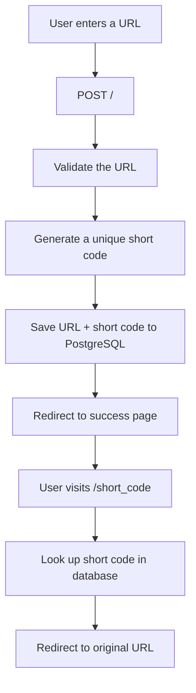

# MicroURL

A simple URL shortening web application built with FastAPI, SQLAlchemy, SQLite, and Jinja2.

[🚀 Live Demo](https://microurl-mrde.onrender.com/)

MicroURL takes a long URL and generates a unique short URL that redirects users to the original address.

## Features

- Shorten long URLs into 6-character short codes
- Validate URLs before storing them
- Store shortened URLs in a SQLite database
- Redirect short URLs to their original destinations
- Detect short-code collisions before creating a URL
- Display a success page with the generated short URL
- Copy the generated URL using the browser's Clipboard API
- Custom error pages for invalid or non-existent URLs

## How It Works

The application follows this basic flow:



### Example

A user submits:

```text
https://www.example.com/some/very/long/url
```

MicroURL generates something like:

```text
https://microurl-mrde.onrender.com/aB72xQ
```

When the short URL is visited, MicroURL looks up `aB72xQ` in the database and redirects the user to the original URL.

## Technologies Used

* **Python**
* **FastAPI** — Web framework
* **SQLAlchemy** — ORM and database interaction
* **SQLite** — Database
* **Pydantic** — URL validation
* **Jinja2** — HTML templating
* **HTML/CSS/JavaScript** — Frontend
* **uv** — Python project and dependency management

## Project Structure

```text
MicroURL/
├── README.md
├── codes.db
├── pyproject.toml
├── uv.lock
└── src/
    ├── __init__.py
    └── microurl/
        ├── __init__.py
        ├── database.py
        ├── functions.py
        ├── main.py
        ├── models.py
        ├── static/
        │   └── css/
        │       └── main.css
        └── templates/
            ├── error.html
            ├── home.html
            ├── layout.html
            ├── not_found.html
            └── success.html
```

## Installation

### 1. Clone the repository

```bash
git clone <your-repository-url>
cd MicroURL
```

### 2. Install dependencies

This project uses **uv** for dependency management.

If you already have uv installed:

```bash
uv sync
```

This creates the project's virtual environment and installs the dependencies specified by the project configuration and lock file.

### 3. Run the application

```bash
uv run uvicorn src.microurl.main:app --reload
```

The application will be available at:

```text
http://127.0.0.1:8000
```

## Database

MicroURL uses **SQLite** with **SQLAlchemy**.

The `Code` model contains two fields:

| Field          | Type      | Description                        |
| -------------- | --------- | ---------------------------------- |
| `short_code`   | String(6) | Unique short identifier            |
| `original_url` | Text      | Original URL submitted by the user |

The short code is used as the primary key, ensuring that two database records cannot have the same short code.

## Redirects

When a user visits a shortened URL such as:

```text
https://microurl-mrde.onrender.com/aB72xQ
```

the application searches the database for `aB72xQ`.

If it exists, FastAPI returns an HTTP redirect to the stored original URL.

If it doesn't exist, the application displays an error page.

## Error Handling

MicroURL handles:

* Invalid URLs → `400 Bad Request`
* Non-existent short codes → `404 Not Found`
* Short-code collisions → checked before inserting into the database
* Database uniqueness → enforced by the `short_code` primary key

## What I Learned

This project was built as a learning project to gain practical experience with backend development and APIs.

Through the project, I practiced:

* Building routes with FastAPI
* Handling GET and POST requests
* Processing HTML forms
* FastAPI dependency injection
* Validating user input with Pydantic
* Working with SQLAlchemy
* Creating and querying a SQLite database
* Creating database models
* Generating unique identifiers
* HTTP status codes
* HTTP redirects
* Jinja2 templates
* Serving static files
* Browser-side JavaScript
* Database constraints
* Understanding potential race conditions
* Managing Python dependencies with uv
* Deploying a FastAPI application
* Connecting an application to a production PostgreSQL database
* Using environment variables for configuration

## Future Improvements

Possible improvements include:

* Add URL expiration
* Add click/visit statistics
* Add custom short codes
* Add a REST API alongside the web interface
* Add automated tests
* Improve collision handling using database exceptions
* Add API documentation and examples
* Improve the frontend and user experience

## Status

**Completed — Learning Project**

MicroURL was created to practice building a small full-stack backend application with FastAPI and SQLAlchemy.

The project is now publicly deployed and available to try through the
[Live Demo](https://microurl-mrde.onrender.com/)

